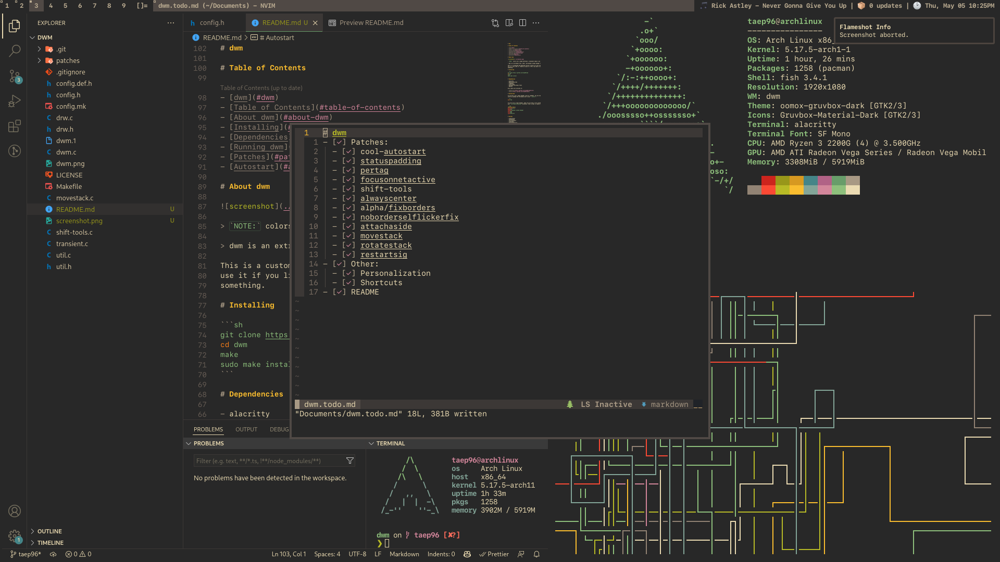

# dwm

## Table of Contents

- [dwm](#dwm)
  - [Table of Contents](#table-of-contents)
  - [About dwm](#about-dwm)
  - [Installing](#installing)
  - [Dependencies](#dependencies)
  - [Running dwm](#running-dwm)
  - [Patches](#patches)
  - [Autostart](#autostart)

## About dwm



> dwm is an extremely fast, small, and dynamic window manager for X.

This is a customized and modified version of dwm for my own use. Feel free to
use it if you like it. Create an issue or a PR if you want to add or fix
something.

## Installing

```sh
git clone https://github.com/taep96/dwm
cd dwm
make
sudo make install
```

## Dependencies

- `alacritty`
- `betterlockscreen`
- `empress`
- `flameshot`
- `j4-dmenu-desktop`
- `libxft-bgra`
- `monospace` and `emoji` fonts

Also check out my builds of:

- [dwmblocks](https://github.com/taep96/dwmblocks)
- [dmenu](https://github.com/taep96/dmenu)

## Running dwm

If you don't use a login manager (such as lightdm), you can start dwm with
startx by adding the following line to your `.xinitrc`:

```sh
exec dwm
```

If you do use a login manager, make sure you have a file called dwm.desktop in
your `/usr/share/xsessions` directory. This is what it should look like:

```ini
[Desktop Entry]
Encoding=UTF-8
Name=Dwm
Comment=Dynamic window manager
Exec=dwm
Icon=dwm
Type=XSession
```

## Patches

- alwayscenter
- attachaside
- cool-autostart
- fixborders
- focusonnetactive
- movestack
- noborderselflickerfix
- pertag
- restartsig
- rotatestack
- shif-tools
- statuspadding

## Autostart

Before entering the handler loop, dwm will run `~/.autostart.sh`. Below is an
example of autostart.sh:

```sh
#! /bin/bash
/usr/lib/polkit-gnome/polkit-gnome-authentication-agent-1 &
~/.fehbg &
picom &
dwmblocks &
discord --enable-gpu-rasterization & # Fix server menu scroll lag
firefox &
```

The example autostart.sh above sets wallpaper and runs polkit agent, compositor,
dwmblocks, Discord, and Firefox.
